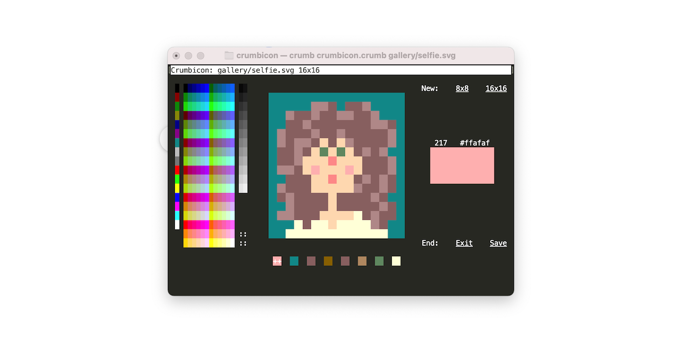
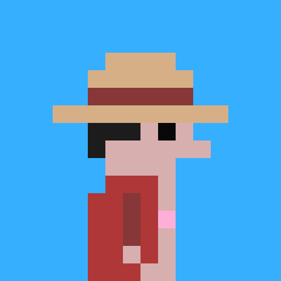
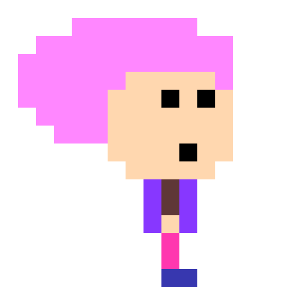
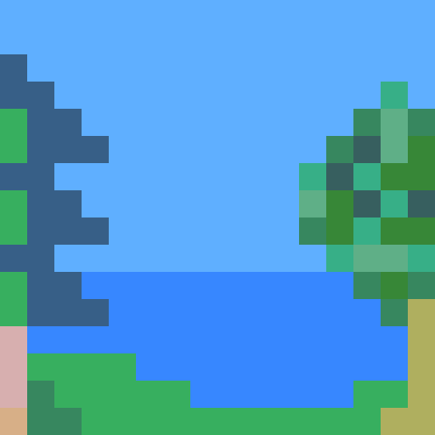
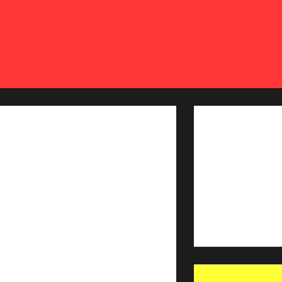

# Crumbicon

Crumbicon is a mouse driven icon editor for your terminal. 

It creates, and then edits svg images that can be used as website favicons (i.e. the little icons that appear at the top tabs etc.). Icons can be 8 pixels by 8 pixels, or 16 pixels by 16 pixels, utilizing 256 colors. 

It's written in [Crumb](https://github.com/liam-ilan/crumb).

<p align=center></p>

# Install

## Pre Built Binaries

Pre built binaries are provided for each [release](https://github.com/ronilan/crumbicon/releases).

Note: `*-macos-15.tar.gz` is for Apple Silicon, `*-macos-13.tar.gz` is for Intel CPU.

# From Source

Building the app and toolchain from from source can be done locally, or within a Docker container that has a mounted volume to save drawn icons.

### Locally

Clone the repo: 
```
git clone git@github.com:ronilan/crumbicon.git
```

CD into directory: 
```
cd crumbicon
```

Build Crumb Interpreter and Loaf Bundler: 
```
chmod +x setup.sh && ./setup.sh
```

Run (using interpreter):
```
./crumb crumbicon.crumb
```

Build:
```
./loaf crumbicon.crumb crumbicon
```

Run (as stand alone executable):
```
./crumbicon
```

### With Docker:

Build: 
```
docker build -t crumbicon git@github.com:ronilan/crumbicon.git#main
```
Run: 
```
docker run --rm -it -v ${PWD}:/crumbicon/icons crumbicon
```

Or "all in one": 
```
docker run --rm -it -v ${PWD}:/crumbicon/icons $(docker build -q git@github.com:ronilan/crumbicon.git#main)
```

Then in the shell:
```
./crumbicon ./icons/favicon.svg
```

This will save the generated icons to your current working directory!

# Use

## Drawing

- Hover over color pickers to see color.
- Click to pick color.
- Click to place them on the canvas.
- Drag to draw multiple pixels.
- Shift, Click for flood fill.
- Palette at bottom allows to "collect colors". Click to choose where to place selected.
- Save to save and exit.
- Exit to exit without save.
- 16x16 to start new icon.
- 8x8 to start new icon.

## Files
- Command line argument to provide file name `./crumb crumbicon.crumb ./icons/favicon.svg` 
- Can open files created by Crumbicon.
- Will abort when file is not created by Crumbicon, but there are issues. Avoid.

# Gallery

> Made something cool with Crumbicon? Make a pull request!



###### Fabriqué au Canada : Made in Canada 🇨🇦